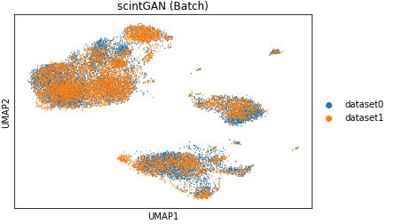

# scintGAN

The scintGAN is a two-stage generative adversarial network-based model for single-cell data integration. scintGAN mainly contains two steps to model the general and specific batch effects respectively.  By modeling different types of batch effects in different stages, scintGAN can project cells to an embedding space in which the distance between cells reflects the biological variance not batch effects.  For more details, please see scintGAN manuscript.

## Installation

scintGAN can be downloaded from GitHub:

```
git clone https://github.com/23AIBox/23AIBox-scintGAN-RAR-.git
```

The python environment required for scintGAN running can be configure as follows: 

```
conda env update -f environment.yml
```


## Input format and preprocessing

For multiple scRNA-seq data sets, please process them into `AnnData` format. The`.obs` correspond to cells and `vars` correspond to genes. 

Preprocessing function has been implemented in the file `utils.py`. And `single_cell_data_process()` function can be used to preprocess the raw single cell data.

## Running scintGAN

Before running scintGAN in terminal, please edit the file `hyper_parameters.py` to customize the arguments according to the data (See Parameters section for more details).

Then, for multiple scRNA-seq data set files in the same file folder, run the following command in terminal to integrate multiple data sets, and the preprocessing step can be performed by setting the argument `pp` to 1:

```shell
python scintGAN.py --file_name adata1.h5ad adata2.h5ad adata3.h5ad --pp 1
```

The embeddings of stage one and stage two will be saved in `.obsm['X_scVGAN']` and `.obsm['X_scintGAN']` of `adata` which is input.

## A quick tutorial of integration of PBMC data 

The PBMC data includes two batches of PBMC. We'll show how to use scintGAN integrate the PBMC data. The two batches of PBMC data can be obtained in https://cf.10xgenomics.com/samples/cell-vdj/3.1.0/vdj_v1_hs_pbmc3/vdj_v1_hs_pbmc3_filtered_feature_bc_matrix.tar.gz and https://cf.10xgenomics.com/samples/cell-exp/2.1.0/pbmc8k/pbmc8k_filtered_gene_bc_matrices.tar.gz respectively. We suppose the needed environment and scintGAN have been installed well.

### Reading and save as `h5ad` format

After unzip these two file, `read_10x_mtx()` function in `Scanpy` package is recommended to read them.

```python
import scanpy as sc
adata_3 = sc.read_10x_mtx('./pbmc3/GRCh38/')
print(adata_3)
adata_5 = sc.read_10x_mtx('./pbmc5/')
print(adata_5)
adata_3.write('./pbmc3.h5ad',compression = 'gzip')
adata_5.write('./pbmc5.h5ad',compression = 'gzip')
'''
output:
AnnData object with n_obs × n_vars = 8381 × 33694
    var: 'gene_ids'
AnnData object with n_obs × n_vars = 7231 × 33538
    var: 'gene_ids', 'feature_types'
'''
```

### Integration by using scintGAN

As shown in Running scintGAN section, we use the following command to integrate the two scRNA-seq PBMC data sets.

```
python scintGAN.py --file_name pbmc3.h5ad pbmc5.h5ad --pp 1
```

### Output

The integration results of two PBMC data sets in two stages will be saved in  `.obsm['X_scVGAN']` and `.obsm['X_scintGAN']` of `adata` respectively. By default, the dimension of result embedding of each cell is 30 in two stages.

### Visualization

For the integration results, we can use the following codes to visualize them.

```
adata = sc.read('./results.h5ad')
batch_key='dataset'
cell_type_key='cell_type'

sc.pp.neighbors(adata,use_rep='X_scintGAN')
sc.tl.umap(adata)

sc.pl.umap(adata, color=[batch_key],title='scintGAN'+' (Batch)')
sc.pl.umap(adata, color=[cell_type_key],title='scintGAN'+' (Cell Type)')
```




## Parameters

The file `hyper_parameters.py` indicate the arguments for scintGAN. 

### Training config

+ `hidden_dim`: Dimensions of latent variables.
+ `batch_key`: The batch key in `adata.obs` .
+ `batch_size`: The batch size during training and integration (set as 128 by default).
+ `target_label`: The target batch label in stage two (set as 0 by default).

### Hyper-parameters of stage one:

+ `scVGAN_G_lr`: The learning rate of generator in stage one (set as 0.001 by default).
+ `scVGAN_D_lr`: learning rate of discriminator in stage one (set as 0.001 by default).
+ `scVGAN_G_weight_decay`: The weight decay of generator in stage one (set as 0.01 by default).
+ `scVGAN_D_weight_decay`: The weight decay of discriminator in stage one (set as 0.01 by default).
+ `scVGAN_max_epochs`: The maximum epochs of training in stage one (set as 160 by default).
+ `scVGAN_max_iterations`: The maximum iterations of training in stage one (set as 20000 by default).
+ `scVGAN_logs_path`: The save path of logs in stage one.
+ `scVGAN_G_path`: The save path of generator weights in stage one.
+ `scVGAN_D_path`: The save path of discriminator weights in stage one.

### Hyper-parameters of stage two:

+ `scStarGAN_G_lr`: The learning rate of generator in stage two (set as 0.0002 by default).
+ `scStarGAN_D_lr`: The learning rate of discriminator in sstage two (set as 0.0002 by default).
+ `scStarGAN_C_lr`: The learning rate of cell type identification model in stage two (set as 0.0002 by default).
+ `scStarGAN_G_weight_decay`: The weight decay of generator in stage two (set as 0.01 by default).
+ `scStarGAN_D_weight_decay`: The weight decay of discriminator in stage two (set as 0.01 by default).
+ `scStarGAN_C_weight_decay`: The weight decay of cell type identification model in stage two (set as 0.01 by default).
+ `scStarGAN_max_epochs`: The maximum epochs of training in stage two (set as 200 by default).
+ `scStarGAN_max_iterations`: The maximum iterations of training in stage two (set as 16000 by default).
+ `scStarGAN_logs_path`: The save path of logs in stage two.
+ `scStarGAN_G_path`: The save path of generator weights in stage two.
+ `scStarGAN_D_path`: The save path of discriminator weights in stage two.
+ `scStarGAN_C_path`: The save path of cell type identification model weights in stage two.

### Input and output settings:

+ `data_path`: The path of single cell data.
+ `file_name`: The file name of single cell data.
+ `save_data_path`: The path for results saving.
+ `save_file_name`: The file name of data after integration.
+ `pp`: The choice of whether to perform the preprocessing step. The argument type is integer. 0 represent that no preprocessing step will be performed, and any integer greater than or equal to 1 represent that the data set will be preprocessed.

## Output

The integration results of stage one and stage two will be saved in  `.obsm['X_scVGAN']` and `.obsm['X_scintGAN']` of `adata` respectively.  

## Visualization

Visualization of UMAP plots has been implemented in the file `visualization.py` . For a result integrated by scintGAN,  the following command can be used to visualize the UMAP plots.

```shell
python visualization.py --data_path ./results/results.h5ad
```


